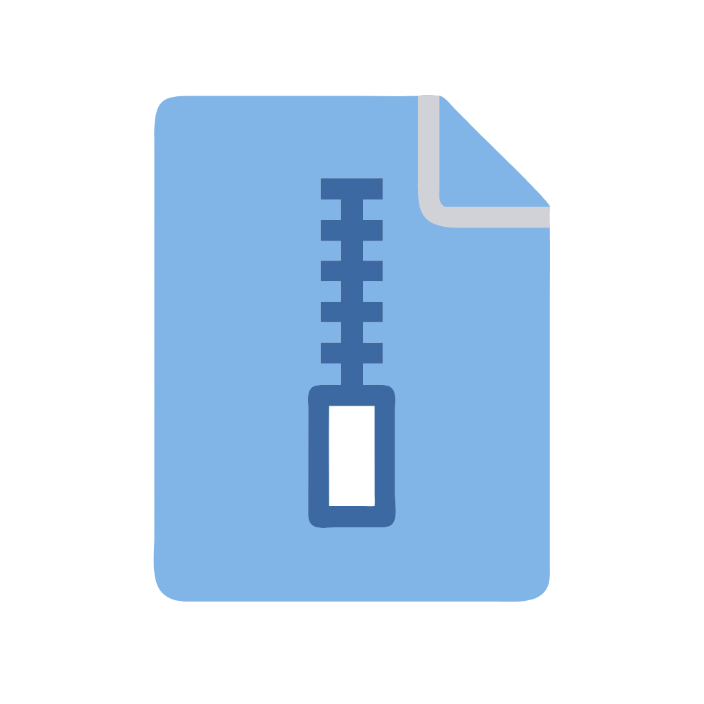

# Project To Markdown



**Project To Markdown** is a Python application that converts project files into structured markdown format, optimizing documentation for AI analysis. Designed to enhance the performance of advanced language models like **GPT and Claude**, it improves the efficiency of AI Retrieval-Augmented Generation (RAG) systems. 

The tool offers both graphical and command-line interfaces, making it accessible to various users. By transforming content into an AI-friendly format, Project To Markdown enables AI assistants to provide more accurate and context-aware responses when queried about project details.

## Demo

Use GUI version to generate markdown results. Then, attach these results to GPT or Claude Chat to get more accurate answers to your questions.


https://github.com/user-attachments/assets/8049c059-d0fe-4994-80bf-3e6f01e70879


## Recommended Use Cases

1. Document your entire project in markdown format and have it reviewed by AI. Use it to solve complex problems that span multiple files. This approach is easier as it doesn't require learning new AI tools and can be directly applied to existing AI chat interfaces.

2. Document the 'examples' folder of new or lesser-known open-source repositories. AI models don't always have the most up-to-date information, so this method can yield higher quality responses. When there's a lot of practical example data, it can significantly accelerate app development.

## Features

- Convert project files to markdown, split by subfolder.
- Merge all files into a single markdown file (optional)
- Add timestamps to generated markdown filenames (optional)
- Generate a folder structure of the project (optional)
- GUI for easy interaction
- CLI for automation and scripting
- Respects .gitignore rules

## Installation

1. Clone the repository:
   ```
   git clone https://github.com/easydevv/project-to-markdown.git
   cd project-to-markdown
   ```

2. Set up a virtual environment:
   ```
   python -m venv .venv
   ```
   ```
   .venv\scripts\activate
   ```

3. Install the required dependencies:
   ```
   pip install -r requirements.txt
   ```

## Usage

### GUI Version

To run the GUI version of the application:

```
python main.py
```
or 
```
flet run
```

The GUI allows you to:
- Select a project directory
- Choose conversion options
- Start the conversion process
- View the conversion log

### CLI Version

To run the command-line version:

```
python main_cmd.py PROJECT_PATH [OPTIONS]
``` 

Options:
- `--onefile`: Merge all files into a single markdown file
- `--timestamp`: Add timestamps to generated markdown filenames
- `--no-tree`: Do not generate a folder structure file

Example:
```
python main_cmd.py /path/to/your/project --onefile --timestamp 
```

## Configuration

The application uses a `config.json` file to store default settings. You can modify this file to change the default behavior:

```json
{
  "exclude_types": ["md", "log", "pyc", ...],
  "exclude_folders": [".output-md", "__pycache__", ...],
  "output_folder": ".output-md",
  "max_workers": 4
}
```

- `exclude_types`: File extensions to exclude from conversion
- `exclude_folders`: Folders to exclude from conversion
- `output_folder`: Default folder for generated markdown files
- `max_workers`: (not working yet) Maximum number of concurrent workers for file processing
